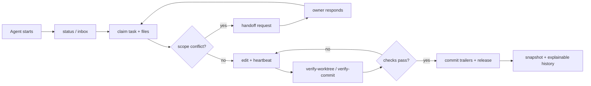

# Coordinaut

[](LICENSE)
[](https://github.com/LevDomasnih/coordinaut/actions/workflows/coordinaut.yml)

[English](README.md) · [Русский](README.ru.md) · [简体中文](README.zh-CN.md) ·
[Deutsch](README.de.md) · [Español](README.es.md) ·
[Português do Brasil](README.pt-BR.md) · [日本語](README.ja.md)

Coordinaut is a coordination layer for parallel AI coding agents working in
the same repository.

It gives Codex, Claude Code, Cursor, and other agents one shared protocol for
task ownership, scoped file locks, handoffs, inbox messages, leases,
verification checks, generated human snapshots, and git attribution.

```text
coordinaut claim --task AGT-20260628-001 --agent frontend-codex --files "src/pages/settings/**"
coordinaut verify-worktree --agent-instance agent_123
coordinaut release --task AGT-20260628-001 --reason "iteration finished"
```

Use it when one agent is no longer enough, but a full hosted orchestration
platform is too much.

## At A Glance

| Need                                      | Coordinaut gives you                                  |
| ----------------------------------------- | ----------------------------------------------------- |
| Run 2-5 coding agents in one repo         | Explicit task claims and scoped file ownership        |
| Avoid accidental overlap                  | Conflict checks for active leases and file scopes     |
| Let agents ask each other for handoff     | Handoff requests, directed messages, broadcasts       |
| Keep work explainable after thread resume | Events, inbox history, snapshots, and commit trailers |
| Start local, grow into a team setup       | JSON, SQLite, or hosted remote storage behind one API |
| Use Codex as the main client              | Install as an MCP server, use CLI only when useful    |

## Two Ways To Use It

**MCP-first, for Codex and other agents.** Add `coordinaut` as an MCP server,
then ask the agent to initialize or coordinate the current repo. The agent calls
tools such as `init_project`, `create_task`, `claim_task`, `verify_worktree`,
`post_message`, and `request_handoff`.

**CLI, for humans and automation.** Use `coordinaut` in a terminal for manual
setup, diagnostics, git hooks, CI checks, shell completions, and debugging.

Both paths use the same coordinator state and the same protocol. You can start
with MCP and still run CLI checks later, or initialize with CLI and let Codex
continue through MCP.

## Install In Codex As MCP

This is the intended client experience: Codex gets Coordinaut as an MCP server,
and agents call tools like `create_task`, `claim_task`, `post_message`,
`verify_worktree`, and `request_handoff`.

Add the published MCP server to Codex:

```json
{
  "mcpServers": {
    "coordinaut": {
      "command": "npx",
      "args": ["@coordinaut/mcp-server"]
    }
  }
}
```

That is enough for the client path: once the MCP server is configured, Codex
can initialize the repository and coordinate agents through tools such as
`init_project`, `create_task`, `claim_task`, and `verify_worktree`.

For local development from a checkout, build Coordinaut once:

```bash
git clone https://github.com/LevDomasnih/coordinaut.git
cd coordinaut
pnpm install
pnpm run build
```

Then point Codex at the built server:

```json
{
  "mcpServers": {
    "coordinaut": {
      "command": "node",
      "args": ["/absolute/path/to/coordinaut/packages/mcp-server/dist/index.js"]
    }
  }
}
```

Most MCP tools accept optional `root`. When the MCP client supports tool
arguments, pass the repository root explicitly so state is written to the right
project.

## CLI Install

```bash
npm install -g @coordinaut/cli
coordinaut --help
```

or run it directly:

```bash
npx @coordinaut/cli init
npx @coordinaut/cli doctor
```

The CLI is still useful for hooks, local checks, shell completions, and manual
debugging:

```bash
coordinaut init
coordinaut doctor
coordinaut verify-worktree --agent-instance agent_123
```

## 60-Second CLI Workflow

```bash
coordinaut init

coordinaut create \
  --title "Fix settings layout" \
  --scope "settings page" \
  --files "src/pages/settings/**"

coordinaut claim \
  --task AGT-20260628-001 \
  --agent frontend-codex \
  --agent-instance agent_123 \
  --thread 019eff77 \
  --files "src/pages/settings/**"

# edit code...

coordinaut verify-worktree --agent-instance agent_123
coordinaut update --task AGT-20260628-001 --status verifying --next "run regression"
coordinaut release --task AGT-20260628-001 --agent-instance agent_123 --reason "iteration finished"
coordinaut snapshot
```

## How Agents Coordinate



The important rule is simple: agents do not coordinate by racing to edit the
same Markdown file. They coordinate through a small state machine, and the
generated Markdown snapshot is just the human-readable view.

## Storage Choices

| Mode     | Best for                         | Command                                |
| -------- | -------------------------------- | -------------------------------------- |
| `json`   | Default local use                | `coordinaut init`                      |
| `sqlite` | Larger long-lived local projects | `coordinaut init --storage sqlite`     |
| `remote` | Distributed teams / hosted sync  | `coordinaut init --storage remote ...` |

Remote team setup:

```bash
COORDINAUT_SERVER_TOKEN="<set-a-local-token>" coordinaut-server

COORDINAUT_TOKEN="<set-a-local-token>" coordinaut init \
  --storage remote \
  --remote-url http://localhost:3737 \
  --team platform \
  --project web-app
```

The hosted server stores team/project state in SQLite, uses Bearer-token auth,
supports `admin`, `member`, and `read` roles, and protects stale writes with
ETag/`If-Match`.

## What It Solves

Markdown task boards are great for people and brittle for parallel agents.

| Without a coordinator                      | With Coordinaut                                |
| ------------------------------------------ | ---------------------------------------------- |
| Two agents can grab the same file silently | Overlapping active claims return a conflict    |
| A dead agent leaves stale ownership behind | Leases expire, and takeover requires a reason  |
| Shared files become accidental merge zones | Handoff requests are explicit and logged       |
| Thread identity disappears after resume    | Agent instances remain stable owners           |
| Commits lose the "who and why"             | Commit trailers link code back to task history |
| Humans still need a readable board         | Markdown snapshots are generated from state    |

State is project-local and portable:

```text
.coordinaut/
  config.json
  state.json          # default JSON storage
  state.sqlite        # optional SQLite storage
  snapshots/
    TASKS.md
```

No `/tmp` state. Start with local files, move to SQLite for long-lived projects,
or point the same CLI/MCP protocol at a hosted team backend.

## Status

Coordinaut has its first public release. The CLI, core package, MCP server,
hosted sync server, JSON/SQLite/remote storage adapters, state migrations, CI
checks, package dry-runs, CLI smoke test, real MCP client smoke test, hosted
server smoke test, automated GitHub Releases, and npm publishing are implemented
and verified.

Published packages:

- `@coordinaut/core`
- `@coordinaut/cli`
- `@coordinaut/mcp-server`
- `@coordinaut/server`

## Quick Start

Initialize a repository:

```bash
coordinaut init
coordinaut doctor
```

For a family of git worktrees, put shared coordinator state in one directory:

```bash
coordinaut init --state-dir ../.coordinaut-shared
```

Create a task:

```bash
coordinaut create \
  --title "Fix settings layout" \
  --scope "settings page" \
  --files "src/pages/settings/**"
```

Claim it before editing:

```bash
coordinaut claim \
  --task AGT-20260628-001 \
  --agent frontend-codex \
  --agent-instance agent_123 \
  --thread 019eff77 \
  --files "src/pages/settings/**"
```

Keep the lease alive while working:

```bash
coordinaut heartbeat --task AGT-20260628-001 --agent-instance agent_123
coordinaut update --task AGT-20260628-001 --status fixing --next "patch layout drift"
```

Verify before handoff, commit, or final response:

```bash
coordinaut verify-worktree --agent-instance agent_123
```

Finish the iteration:

```bash
coordinaut update --task AGT-20260628-001 --status verifying --next "run focused regression"
coordinaut release --task AGT-20260628-001 --agent-instance agent_123 --reason "iteration finished"
coordinaut snapshot
```

## The Agent Protocol

Agents do not need to coordinate by editing the same Markdown file. They follow
a small lifecycle:

1. Inspect current work with `status`.
2. Claim a task and file scope before editing.
3. Heartbeat while working.
4. Request handoff if a shared file is owned by another active claim.
5. Check `inbox` for questions, blockers, handoffs, and broadcasts.
6. Verify modified or staged files against the active claim.
7. Release the lease, record a blocker, or mark the task done.
8. Leave commit trailers so future agents can explain the change.

The generated Markdown snapshot is for humans. The coordinator state, event
log, and message log are the source of truth.

## Handoffs

When another agent owns a scope you need, ask for it:

```bash
coordinaut handoff request \
  --task AGT-20260628-002 \
  --agent backend-codex \
  --agent-instance agent_456 \
  --files "package.json,pnpm-lock.yaml" \
  --reason "need dependency for API client generation"
```

The owner responds:

```bash
coordinaut handoff respond \
  --id handoff_... \
  --status grant_after_commit \
  --agent frontend-codex \
  --response "will release after current verification"
```

Supported responses:

- `grant_after_commit`
- `handoff_now`
- `denied`
- `cancelled`

Every request and response is written to the event log and message log.

## Agent Inbox And Presence

Agents can talk through an inbox instead of scraping raw event logs:

```bash
coordinaut message \
  --from-agent frontend-codex \
  --from-agent-instance agent_123 \
  --to-agent-instance agent_456 \
  --kind question \
  --text "Can you take package.json after this commit?"

coordinaut inbox --agent-instance agent_456
coordinaut inbox-read --agent-instance agent_456 --messages msg_...
```

Broadcasts and mentions are supported too:

```bash
coordinaut message \
  --from-agent release-codex \
  --broadcast \
  --kind blocker \
  --text "Release branch is frozen until CI recovers."
```

See who is active and what they hold:

```bash
coordinaut presence
coordinaut watch --limit 20
```

## Verification And Git Hooks

MCP makes the protocol easy to call, but MCP alone cannot force agents to use
it. Coordinaut includes local checks for the boring-but-important part:
"are these files actually claimed by this agent?"

```bash
coordinaut verify-worktree --agent-instance agent_123
coordinaut verify-commit --agent-instance agent_123 --message-file .git/COMMIT_EDITMSG
```

Install local hooks:

```bash
coordinaut install-hooks
export COORDINAUT_INSTANCE=agent_123
```

The design rule:

```text
MCP is the protocol. Hooks and checks are the enforcement.
```

For PR and CI checks, verify the commit range:

```bash
coordinaut verify-commit-range --range "origin/main..HEAD"
```

This checks commit trailers and, when the referenced task exists in local
coordinator state, verifies changed files against that task's claimed scope.

## Git Attribution

Set local git identity for the current agent:

```bash
coordinaut git-identity \
  --agent frontend-codex \
  --agent-instance agent_123 \
  --thread 019eff77 \
  --task AGT-20260628-001
```

Use commit trailers:

```text
Agent: frontend-codex
Agent-Instance: agent_123
Agent-Thread: 019eff77
Agent-Task: AGT-20260628-001
```

Restore the previous local identity:

```bash
coordinaut git-identity-reset
```

Commit trailers are the durable attribution layer. Local git identity is only a
convenience.

## Explain What Happened

The next agent can reconstruct context from task events, messages, handoffs,
and commit trailers:

```bash
coordinaut explain --task AGT-20260628-001
coordinaut explain --commit 0c464bc
```

Use this before resuming old work, reviewing a suspicious commit, or deciding
whether a stale lease can be taken over.

## MCP Server

Run the server:

```bash
coordinaut-mcp
```

Example client configuration:

```json
{
  "mcpServers": {
    "coordinaut": {
      "command": "coordinaut-mcp",
      "args": []
    }
  }
}
```

Most tools accept optional `root`. Prefer passing the repository root from the
client so the server never writes coordinator state in the wrong directory.

### MCP Tools

| Tool                  | Purpose                                              |
| --------------------- | ---------------------------------------------------- |
| `init_project`        | Initialize `.coordinaut`                             |
| `create_task`         | Create a task                                        |
| `claim_task`          | Claim task scopes                                    |
| `update_task`         | Update status, checks, blockers, and next steps      |
| `heartbeat`           | Extend a lease                                       |
| `release_task`        | Release a lease                                      |
| `list_tasks`          | List tasks                                           |
| `list_my_tasks`       | List tasks by agent, instance, or thread             |
| `detect_conflicts`    | Detect active scope conflicts                        |
| `request_handoff`     | Request a handoff                                    |
| `respond_handoff`     | Respond to a handoff                                 |
| `list_handoffs`       | List handoff requests                                |
| `post_message`        | Append a message                                     |
| `export_snapshot`     | Generate `TASKS.md`                                  |
| `explain`             | Explain a task or commit                             |
| `git_identity`        | Set local git identity                               |
| `git_identity_reset`  | Restore previous git identity                        |
| `doctor`              | Diagnose setup                                       |
| `migrate_state`       | Normalize state schema and write a backup if needed  |
| `verify_worktree`     | Check modified files against claims                  |
| `verify_commit`       | Check staged files and trailers                      |
| `verify_commit_range` | Check commit trailers and task scopes across a range |
| `install_hooks`       | Install local git hooks                              |

## Concepts

### Tasks

Tasks have two identifiers:

- `id`: stable machine id, used as the primary key.
- `displayId`: human-facing id such as `AGT-20260628-001`.

CLI commands accept either value when it is unambiguous.

### Agent Instances

Agent names are display metadata. Agent instances own mutations and locks.

```ts
type AgentInstance = {
  id: string;
  name: string;
  threadId?: string;
  tool: "codex" | "claude" | "cursor" | "unknown";
  startedAt: string;
  lastSeenAt: string;
};
```

Use a stable `--agent-instance` value for the duration of one agent run.

### Lock Modes

| Mode          | Use for                                        | Conflict behavior                |
| ------------- | ---------------------------------------------- | -------------------------------- |
| `exclusive`   | Code, package manifests, lockfiles, registries | Blocks overlapping active claims |
| `shared-docs` | Documentation with explicit coordination       | Can overlap with `shared-docs`   |
| `shared-read` | Read-oriented shared work                      | Can overlap with `shared-read`   |
| `advisory`    | Interest tracking                              | Never blocks                     |

Expired leases are visible but not silently ignored. Taking over an expired
scope requires `--takeover-reason`.

## CLI Reference

```text
init
status
create
claim
update
heartbeat
release
mine
conflicts
message
inbox
inbox-read
presence
watch
handoff request
handoff respond
handoff list
snapshot
explain
git-identity
git-identity-reset
install-hooks
doctor
migrate
verify-worktree
verify-commit
verify-commit-range
completion
```

Run `coordinaut <command> --help` for command-specific options.

Generate shell completions:

```bash
coordinaut completion bash > ~/.coordinaut-completion.bash
coordinaut completion zsh > _coordinaut
coordinaut completion fish > ~/.config/fish/completions/coordinaut.fish
```

## Storage Modes

| Mode     | Use for                           | State location                        |
| -------- | --------------------------------- | ------------------------------------- |
| `json`   | Default local projects            | `.coordinaut/state.json` + JSONL logs |
| `sqlite` | Larger long-lived local projects  | `.coordinaut/state.sqlite`            |
| `remote` | Distributed teams and hosted sync | `coordinaut-server` over HTTP         |

This is the same choice shown near the top, with the operational details kept
here for people wiring real projects.

`coordinaut init --storage sqlite` keeps the same CLI and MCP behavior while
storing state, events, and messages in SQLite.

`coordinaut init --storage remote` writes a local config that points to a
hosted backend. All normal commands (`create`, `claim`, `message`, `doctor`,
MCP tools, and verification) use the remote team/project state.

## Hosted Sync Server

Run the backend:

```bash
COORDINAUT_SERVER_TOKEN="<set-a-local-token>" \
COORDINAUT_SERVER_DATA_DIR=.coordinaut-server \
coordinaut-server
```

The server stores team/project data in SQLite and exposes:

```text
GET  /health
GET  /v1/teams/:team/projects/:project/config
PUT  /v1/teams/:team/projects/:project/config
GET  /v1/teams/:team/projects/:project/state
PUT  /v1/teams/:team/projects/:project/state
GET  /v1/teams/:team/projects/:project/events
POST /v1/teams/:team/projects/:project/events
GET  /v1/teams/:team/projects/:project/messages
POST /v1/teams/:team/projects/:project/messages
POST /v1/teams/:team/projects/:project/backups
```

Auth is Bearer-token based. For one admin token, set
`COORDINAUT_SERVER_TOKEN`. For multiple teams or roles, set
`COORDINAUT_SERVER_TOKENS`:

```json
{
  "<admin-token>": { "team": "platform", "role": "admin" },
  "<read-token>": { "team": "platform", "role": "read" }
}
```

Roles:

- `admin` and `member` can read and write.
- `read` can only read team/project state.

## Multi-Worktree Caveat

By default one checkout has one `.coordinaut` state. If agents work in
separate worktrees or clones, initialize each checkout with the same state
directory:

```bash
coordinaut init --state-dir /path/to/shared-coordinaut-state
```

`coordinaut doctor` prints the resolved root and state path so this is
visible.

## State Migrations

`coordinaut doctor` checks the state schema version. If it reports that
state requires migration, run:

```bash
coordinaut migrate
```

Migration normalizes coordinator state to the current schema and writes a
storage-specific backup before changing it.

## Development

```bash
pnpm install
pnpm run format
pnpm run check
pnpm run test
pnpm run build
```

Smoke-test the built CLI, MCP server, and hosted sync backend:

```bash
pnpm run smoke:cli
pnpm run smoke:mcp
pnpm run smoke:server
```

Release notes live in [docs/release.md](docs/release.md).

Releases are automated from Conventional Commits on `main`: `feat` creates a
minor release, `fix`/`perf` create a patch release, and `!` or
`BREAKING CHANGE:` creates a major release. The workflow bumps versions, commits
the release, tags it, creates or updates the GitHub Release, and publishes npm
packages from the `@coordinaut` scope. See [docs/release.md](docs/release.md)
for details.

## First-Version Baseline

Implemented:

- Shared state directory for worktree families.
- SQLite storage adapter for larger long-lived projects.
- Remote backend for distributed teams.
- Hosted sync with Bearer auth and team/project namespaces.
- Richer MCP client smoke tests.
- Generated shell completions.

## Roadmap

- Web dashboard.
- Hosted multi-tenant deployment hardening.

## License

MIT
